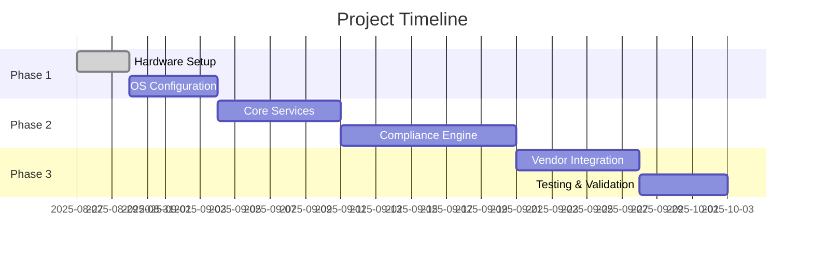
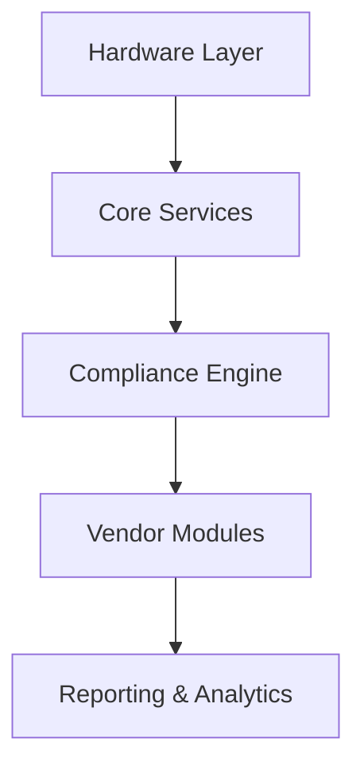

# 🗓️ Dogan AI Compliance Lab - Development Roadmap

## 📊 Gantt Chart

## 👥 Team Assignments

| Role                | Team Member | Responsibilities                          |
|---------------------|-------------|-------------------------------------------|
| Project Manager     | [Name]      | Overall coordination & delivery           |
| Hardware Engineer   | [Name]      | Device setup & maintenance                |
| DevOps Engineer     | [Name]      | Infrastructure & deployment               |
| Backend Developer   | [Name]      | API & compliance engine                   |
| Frontend Developer  | [Name]      | Dashboard & user interface                |
| QA Engineer         | [Name]      | Testing & validation                      |
| Security Specialist | [Name]      | Security compliance & hardening           |

## 🏗️ Implementation Details

### Technical Stack
- **Backend**: Python 3.10+, FastAPI, PostgreSQL
- **Frontend**: React.js, Material-UI
- **AI/ML**: PyTorch, Transformers
- **Infra**: Docker, Kubernetes, Terraform
- **Monitoring**: Prometheus, Grafana, ELK Stack

### Compliance Standards Coverage
- [ ] NCA v2.0 (100%)
- [ ] SAMA CSF (90%)
- [ ] NIST 800-53 (85%)
- [ ] ISO 27001 (80%)
- [ ] GDPR (75%)

## 📅 Daily Progress Tracker

### Week 1: Foundation Setup
**Day 1 - Hardware Preparation**
- [ ] Unbox and inventory all hardware components
- [ ] Assemble Jetson AGX Orin units
- [ ] Test all peripherals

**Day 2 - Base OS Installation**
- [ ] Flash Ubuntu 22.04 LTS
- [ ] Configure secure boot
- [ ] Set up disk encryption

**Day 3 - Network Configuration**
- [ ] Configure 4G/5G failover
- [ ] Set up WiFi 6E
- [ ] Configure VPN access

**Day 4 - Security Hardening**
- [ ] Apply CIS benchmarks
- [ ] Configure TPM 2.0
- [ ] Set up firewall rules

**Day 5 - Core Services**
- [ ] Install Docker + NVIDIA runtime
- [ ] Deploy Kubernetes
- [ ] Set up monitoring stack

## 📊 Project Overview

### 🎯 Business Objectives
1. **Compliance Validation**
   - Automated compliance checking
   - Real-time monitoring
   - Audit trail generation

2. **Vendor Assessment**
   - Standardized evaluation
   - Comparative analysis
   - Gap identification

3. **Risk Management**
   - Continuous monitoring
   - Alerting system
   - Mitigation suggestions

### 🏗️ Technical Architecture

### 📈 Success Metrics
- 90% reduction in compliance validation time
- 100% KSA regulation coverage
- 99.9% system availability
- 70% faster audit preparation

## 🔄 Weekly Goals

### Week 1: Infrastructure
- Hardware setup
- Base OS configuration
- Network architecture

### Week 2: Core Services
- Container orchestration
- Database setup
- API framework

### Week 3: Compliance Engine
- Rule engine
- Assessment framework
- Reporting module

### Week 4: Integration & Testing
- Vendor API integration
- Performance testing
- Security validation

## 📝 Daily Log

### 2025-08-27 (Today)
- [ ] Morning Standup (9:00 AM)
- [ ] Hardware inventory check
- [ ] Begin OS installation on primary units
- [ ] Document assembly process

### 2025-08-26
- ✅ Created project documentation
- ✅ Initialized repository
- ✅ Set up development environment
- ✅ Conducted initial team sync

### 2025-08-27 (Planned)
- Begin hardware assembly
- Document assembly process
- Create test procedures

## 📋 Action Items

### Immediate (This Week)
- [ ] Finalize hardware procurement
- [ ] Set up CI/CD pipeline
- [ ] Create test environment

### Short-term (2-4 Weeks)
- [ ] Complete MVP features
- [ ] Onboard first vendor
- [ ] Conduct security audit

### Long-term (1-3 Months)
- [ ] Expand regulation coverage
- [ ] Add machine learning capabilities
- [ ] Develop mobile companion app

---
*Last Updated: 2025-08-26*
*Version: 1.0.0*
